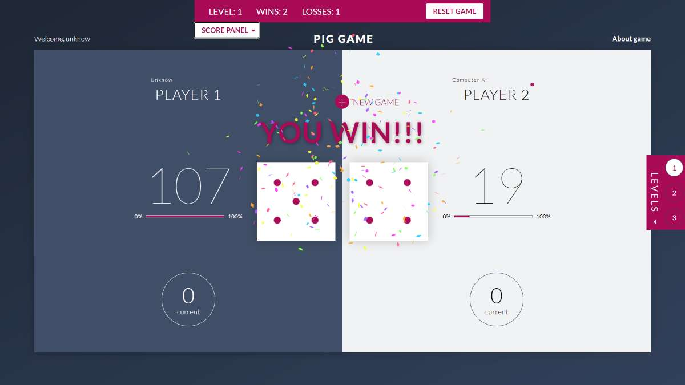

# THE PIG GAME

## About project
A very simple game based on pure JS. You have to score a lot of points and win as fast as possible. There are 3 levels of difficulty (without a count down timer, with a visible count down timer, with an invisible count down timer). You can play with yourself or with your partner (as default name - Computer AI 😁 ). 

## Screenshot


## Demo version
Click here  -> [DEMO](https://krzysztofgrudzien.github.io/pig-game/)

## Setup and how to use it

  ### Clone project
  ```bash
  git clone https://github.com/KrzysztofGrudzien/pig-game
  ```
  ### Install project
  ```bash
  npm install
  ```
  ### Start project on your local computer using development mode
  ```bash
  npm run start
  ```
  ### Build production version
  ```bash
  npm run build
  ```
  ### Build production version and publish the page using `gh-pages` branch
```bash
npm run publish
```
## Usage
For fun !!!

## Technologies Used
- JavaScript
- Webpack 4
- HTML5
- CSS
- SASS
- BEM Methodology

## Design tools
- Adobe XD

## Additional libraries
[canvas confetti](https://www.npmjs.com/package/canvas-confetti)

## Project status 
In progress 🎉

## Rules

I. You have to login to the game writing your name or nick name and click ENTER 
- a) If input form will be empty you will be login as 'Unknow' 


II. Choose your level
- a) Without count down timer - you can play any time you want
- b) With count down timer - you have 10 minutes to win 
- c) With invisible count down timer - your time is between 5 to 10 minutes

III. How we play
- a) In the middle of the screen you see buttons. If you click at the TOP one, the numbers will be random. If you click at the BOTTOM one your scores will be hold in current scores. As alternative, you can use in the same way keyboard - ARROW UP and ARROW DOWN. If you make mistake and press ENTER your current score will be save in the memory of your current score.
- b) If the player random 1 in first or second cubes - he lost current score and gave a chance to next player !!!
- c) The white board means - which one of the players is playing now.
- d) We can play with myself or with the partner (as default name - Computer AI 😁 )  ( PLAYER 1 uses the mouse and click on the buttons ), ( PLAYER 2 uses ARROW UP and ARROW DOWN. )
- e) When player 1 or player 2 win game, one of them can click button new game or press ENTER.) 
- f) When player 1 or player 2 win match, one of them can click button new match or press (ENTER, ARROW UP, ARROW DOWN) - everything will be removed, page will be reload and you start from the beginning.
- g) On the panel scores, there is a button RESET GAME and when you click it, everything will be removed, page will be reload and you start from the beginning.

LEVEL I
- a) The player 1 win game when current score is equal or more than 100. Otherwise the player 2 win.
- b) The player 1 win match when wins score is equal 10. Otherwise the player 2 win.

LEVEL II
- a) The player 1 win game when current score is equal or greater than 100. Otherwise the player 2 win.
- b) The player 1 win match when winnig score is equal 10 or the winning score is greater than the winnig score of player 2. Otherwise the player 2 win.
- c) The player 1 win match when winnig score is greater than the winnig score of player 2 and count down timer is equal 00:00. Otherwise the player 2 win.


LEVEL III
- a) The player 1 win game when current score is equal or greater than 100. Otherwise the player 2 win.
- b) The player 1 win match when winnig score is equal 10 or the winning score is greater than the winnig score of player 2. Otherwise the player 2 win.
- c) The player 1 win match when winnig score is greater than the winnig score of player 2 and count down timer is equal 00:00. Otherwise the player 2 win.
- d) As a difficulty you can't see the count down timer so you don't know how much time you have to complete the game.


IV. Others random game boards




## License
No license

## Contact
Created by [Krzysztof Grudzień](http://criscode.eu) - feel free to contact me!


